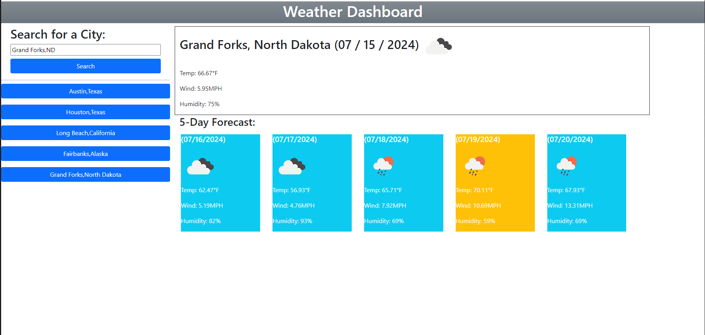

# M6C_WeatherDashboard

## Description

In this web application the user is presented a blank page when they first connect to the site with a search form on the left hand side. The form has user input validation by using the geolocation api that returns the coordinates to a city given you provide a real place in the US. After searching for a city using the city name and state abbreviation, a new button is added to the search history area and you are presented with the current weather conditions in a big space followed by 5 rectangles that present the weather conditions for the next 5 days. The rectangles are color coded depending on the temperature. 70 and below is blue, between 70 and 89 is yellow and above 90 is red. The application saves your search history with local storage and loads each search history as a buttons on the left hand side upon re-entering or refreshing the page. Those buttons when clicked will present the weather conditions like stated early without having to use the search bar. The page also remmembers your last viewed city so upon refreshing or re-entering you are presented with the weather conditions to your last viewed city.

    home page

link to github pages: https://alejandrom2023.github.io/M6C_WeatherDashboard/

## Installation

N/A

## Usage

By connecting to the page you will be presented with a blank page if it is your first time connecting. There is a search form in the left hand side of the page to search for cities weather. If the city informatio is entered correctly info about the weather will be presented with color codded cards depending on the temperature range.

## Credits

N/A

## License

The last section of a high-quality README file is the license. This lets other developers know what they can and cannot do with your project. If you need help choosing a license, refer to [https://choosealicense.com/](https://choosealicense.com/).
